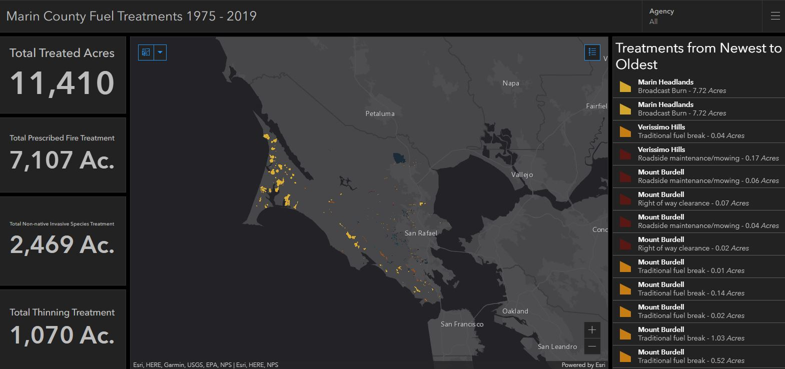

## Final Project Ideas for New Maps Plus
### **Topic 1: Interactive Bi-variate Potential Fire Fuels Map**  
I want to design a map that explores the relationship between burn probability and above ground live biomass in the state of California. I'm interested in exploring this topic to identify areas that might have high burn probability, and a potentially low above ground live biomass. This could potentially equate with areas that might need specific types of fuel treatment for dealing with dead biomass. Additionally, low burn probability areas and high above ground live biomass could be indicative of areas that lack dead fuels, have properly thinned/treated forests and/or have vegetation types that that are not particularly fire prone. The audience of fire planners and resource managers could use the map as a tool in the priortization process of where to distribute treatment resources for fire mitigation.  

**Input datasets for the bi-variate map are two rasters:**  
[Aboveground live tree biomass (k=10)](https://lemma.forestry.oregonstate.edu/projects/ca-biomass)  
[Annual Burn Probability](https://storymaps.arcgis.com/stories/32de73f1cfb040c79f80c189ccefe061)  

### **Topic 2: The most vulnerable lands and people in California wildfires**  
I want to design a map that allows the vizualization of high burn probability locations and vulnerable populations in the state of California. I would like to map this topic because it has the potential identify geographies that are particularly at risk from both a natural resource perspective but also from a human one, and that convergence could be more meaningful than either of those factors on their own. I think this could be a particularly helpful tool for policy makers and resource managers in helping them plan fuel treatments, whether certain social services may be required (rides for the disabled in an emergency etc.) fire mitigation strategies and simply where need is greatest.  

**Input datasets for the bi-variate map are two rasters:**  
[Annual Burn Probability](https://storymaps.arcgis.com/stories/32de73f1cfb040c79f80c189ccefe061)  
[U.S. Census Data](https://data.census.gov/)  

### **Topic 3: Dashboard of fuel treatment from 1975 - 2019 in Marin County, California**  
I want to design a map / dashboard that allows the display of fuel treatments with associated statistics by treatment type and with filtering capability. I would like to map this data because the Marin Safe Fire Council is constantly performing new treatment but they lack a single location / data repository where they can find out where work has been done historically. I think this could be a particularly helpful tool for policy makers and resource managers in helping them plan fuel treatments, whether certain social services may be required (rides for the disabled in an emergency etc.) fire mitigation strategies and simply where need is greatest.  

**Sample screenshot of a beta ArcGIS Online Dashboard with the same goal:**  

