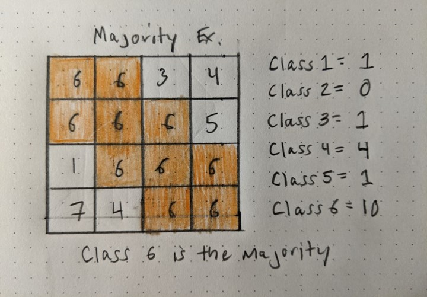

# United States Communities in Harms Way:
## **Where are the Vulnerable in Relation to Wildfire Hazards**  

<!-- TOC -->

## Table of Contents
- [I. Introduction](#introduction)
- [II. Methodology](#II-Methodology)
   - [A. Data](#a-data)
   - [B. Medium for Delivery](#b-medium-for-delivery)
   - [C. Application Layout](#c-application-layout)
   - [D. Thematic Representation](#d-thematic-representation)
   - [E. User Interaction](#e-user-interaction)
   - [F. Aesthetics and Deisgn Considerations](#f-aesthetics-design-considerations)
   - [G. Conclusion](#g-conclusion)
   
<!-- /TOC -->

## I. Introduction
This project examines where wildfire hazard potential intersects with socially vulnerable census designated places throughout the conterminous United States. The data sources span from 2018 to 2020. 

The map will appeal to those looking to understand not only how wildfire can affect developed areas and their inhabitants but what developed area may be in greater need of support both prior to and after wildland fires. 

The user will be inspired to explore areas not traditionally thought of as areas with high wildfire potential such as the southeast

At a general level the map will potentially reveal specific communities that could benefit from additional emergency response planning effort.

## II: Methodology
First provide a general statement summarizing the following subsections (one or two sentences).

### A. Data

1. [2020 Wildfire Hazard Potential (WHP) for the United States](https://www.fs.usda.gov/rmrs/datasets/wildfire-hazard-potential-united-states-270-m-version-2020-3rd-edition). This is a 270-m spatial resolution raster dataset that classifies Wildfire Hazard Potential in the conterminous United States into 5-discrete classes based on percentile breaks:   
       
    - **Class 1:** Very Low
    - **Class 2:** Low
    - **Class 3:** Moderate
    - **Class 4:** High
    - **Class 5:** Very High  
    - **Class 6:** Non-burnable  
    - **Class 7:** Water  

2. [U.S. Census Designated Places (CDPs) ](https://www2.census.gov/geo/tiger/GENZ2020/shp/cb_2020_us_place_500k.zip). These are simplified representations of selected geographic areas from the U.S. Census Bureau's Master Address File / Topologically Integrated Geographic Encoding and Referencing (MAF/TIGER) Database (MTDB). These boundary files are specifically designed for small-scale thematic mapping.    

3. [Centers for Disease Control Social Vulnerability Index (SVI)](https://www.atsdr.cdc.gov/placeandhealth/svi/documentation/SVI_documentation_2018.html). This data is available at the tract level and has four individual vulnerability components plus an aggregate score:  

    - **Socioeconomic**
    - **Household Composition & Disability**
    - **Minority Status & Language**
    - **Housing Type & Transportation**
    - **Overall Vulnerability**  

The process for exploring, processing and ultimately analyzing the data used Python / Jupyter Notebooks with the the following libraries: Pandas, Matplotlib and GeoPandas. The WHP data was analyzed using zonal statistics where the raster dataset was overlayed with the CDPs to calculate the 'majority' of pixels in each polygon. Based on the majority a WHP class was assigned to each CDP. 

### B. Medium for Delivery
### C. Application Layout
### D. Thematic Representation
### E. User Interaction
### F. Aesthetics and Design Considerations
### G. Conclusion

## References
- [Community Wildfire Prevention & Mitigation Report](https://www.fire.ca.gov/media/5584/45-day-report-final.pdf) ordered the by California Governors Office
- Centers for Disease Control and Prevention/ Agency for Toxic Substances and Disease Registry/ Geospatial Research, Analysis, and Services Program. CDC/ATSDR Social Vulnerability Index 2018 Database United States.