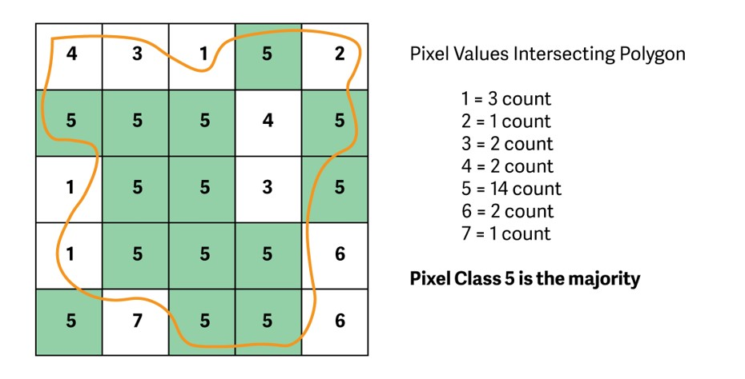

# United States Communities in Harm's Way:
## **Where are the Vulnerable in Relation to Wildfire Hazards?**  

<!-- TOC -->

## Table of Contents
- [I. Introduction](#introduction)
- [II. Methodology](#II-Methodology)
   - [A. Data](#a-data)
   - [B. Medium for Delivery](#b-medium-for-delivery)
   - [C. Application Layout](#c-application-layout)
   - [D. Thematic Representation](#d-thematic-representation)
   - [E. User Interaction](#e-user-interaction)
   - [F. Aesthetics and Deisgn Considerations](#f-aesthetics-design-considerations)
   - [G. Conclusion](#g-conclusion)
   
<!-- /TOC -->

## I. Introduction  
This project examines where wildfire hazard potential (WHP) and census tracts that measure relative social vulnerbaility (SVI) intersect census designated places (CDPs) throughout the conterminous United States. The data sources span from 2018 to 2020 and are from the U.S. Forest Service, the U.S. Census Bureau and the Centers for Disease Control and Prevention.

The map will appeal to those looking to understand not only how wildfire can affect developed areas and their inhabitants but what developed area may be in greater need of additional support and planning both prior to and after wildland fires with the aim of mitigating human suffering and financial loss.

The user will be inspired to explore areas not traditionally thought of as areas with high wildfire potential such as the southeast.

At a general level the map will potentially reveal specific communities that could benefit from additional emergency response planning efforts as well as specific regions not commonly thought of as being at risk for wildfire.

**Full Scale Wire Frame:**   

  

**Zoomed Wire Frame:**  

  

## II: Methodology  
The methods for the project involve two different types overlay analysis: zonal statistics and weighted mean, both of which are performed on the CDP polygons. The zonal statistics use a majority method with raster values for WHP in a CDP and weighted mean is used with SVI census tracts intersected with CDPs.

### A. Data  

1. [2020 Wildfire Hazard Potential (WHP) for the United States](https://www.fs.usda.gov/rmrs/datasets/wildfire-hazard-potential-united-states-270-m-version-2020-3rd-edition). This is a 270-m spatial resolution raster dataset that classifies wildfire hazard potential in the conterminous United States into 5-discrete classes based on percentile breaks:   
       
    - **Class 1:** Very Low  
    - **Class 2:** Low  
    - **Class 3:** Moderate  
    - **Class 4:** High  
    - **Class 5:** Very High   

2. [U.S. Census Designated Places (CDPs)](https://www2.census.gov/geo/tiger/GENZ2020/shp/cb_2020_us_place_500k.zip). These are simplified representations of selected geographic areas from the U.S. Census Bureau's Master Address File / Topologically Integrated Geographic Encoding and Referencing (MAF/TIGER) Database (MTDB). These boundary files are specifically designed for small-scale thematic mapping.    

3. [Centers for Disease Control Social Vulnerability Index (SVIs)](https://www.atsdr.cdc.gov/placeandhealth/svi/documentation/SVI_documentation_2018.html). This data is available at the tract level and has four individual vulnerability themes plus an overall theme:  

    - **Socioeconomic**
    - **Household Composition & Disability**
    - **Minority Status & Language**
    - **Housing Type & Transportation**
    - **Overall Vulnerability**  

**Social Vulnerability Index Classes:**  

   

The process for exploring, processing and analyzing the data used Python / Jupyter Notebooks with the the following libraries: Pandas, Matplotlib and GeoPandas. The WHP data was analyzed using zonal statistics where the raster dataset was overlayed with the CDPs to calculate the 'majority' of pixels in each CDP polygon. Based on the majority, a WHP class was assigned to each CDP.  

**How majority zonal statistics work:**  

 

Additionally, CDPs with classes of 1 and 2 were removed so that only CDPs with moderate to very high (classes 3, 4 and 5) wildfire hazard potential were included in the final output.  

CDPs were the minimum mapping unit for the analysis, yet the SVI data is available only at the tract level which is too detailed for this analysis. To mitigate this issue another type of overlay analysis was performed; weighted mean area analysis. In this operation the vulnerability theme values (0-1) for each vulnerability theme and the overall vulnerability are averaged again based on the area inside the CDP polygon they intersect with. The larger the area a particular vulnerability theme occupies the greater value or weight it is given in calculating the vulnerability score of the CDP. This operation was performed for each vulnerability theme and for the overall vulnerability for each CDP with a WHP class of 3, 4 or 5.

**Sample results of analyzed and processed data:**  

  

Lastly, the geometric center or centroids of the polygons were taken so that the small or maximum scale mapping could be achieved. This process ensured that the attributes in the polygon were retained in the point output.  

The final output polygon and point files are GeoJSON.  

### B. Medium for Delivery  

The map/front-end is a responsive browser-based application accessible across mobile and desktop devices.  

The technology stack includes HTML/CSS/JavaScript that uses the [Leaflet](https://leafletjs.com/) mapping library with a [Bootstrap](https://getbootstrap.com/docs/4.0/examples/) responsive framework.   

### C. Application Layout  

The web page is laid out using a simple title bar w/ icons that represent community and fire, and include a text based search tool with autocomplete functionality. In addition, there is a hidden sidebar that contains a description of the map, instructions on how to use it and a static legend. All of these components are resized or removed responsively using CSS media queries.

### D. Thematic Representation  

The map uses different thematic representations at different scales. At maximum scale the map uses graduated symbols to display overall vulnerability theme by CDP broken up into five classes and sequential colors to display the three class WHP resulting in a bi-variate map. 

The vulnerability themes in the top 10% (the 90th percentile of values) are given a value of 1 to indicate high vulnerability. Tracts below the 90th percentile are given a value of 0. Thus, when mapped ranged from 0-1 and have a 5 value ordinal classification assigned:  

**Vulnerability Theme Ordinal Classification:**  

    - **0-0.2:**&nbsp;&nbsp;&nbsp;&nbsp;Low  
    - **0.2-0.4:**&nbsp;Low/Moderate  
    - **0.4-0.6:** Moderate  
    - **0.6-0.8:**&nbsp;High/Moderate  
    - **0.8-1:**&nbsp;&nbsp;&nbsp;&nbsp;High  

When zoomed to level 10 or greater CDP polygons classified using sequential color replace the graduated symbols showing the extent of the actual CDP as mapped along with its WHP.  

### E. User Interaction  

The map is full screen map and requires user input to explore. These actions include panning, zooming, hovering, using search text and clicking on the features. 

Hovering over a point on the map results in getting some basic information about the about that feature.

**Tooltip Example:**  

  

Click on a point of interest to zoom to that location and see the community boundary with WHP classified colors and details including the ordinal classification of vulnerability themes and the actual theme values for that CDP. At this scale the basemap will change to an aerial image so users can get a sense of conditions on the ground. Users can also use the search bar in the upper right of the map to zoom to a community boundary and get the same results as clicking on a feature. This can be useful if the user already has a place in mind to look for. 

**Dropdown Search Example:** 

 

Users can ascertain additional details about the map by clicking the sidebar which opens up two different panels, one with a brief explanation about the map and another with a static legend.

### F. Aesthetics and Design Considerations  
The tone of the map is simple and high contrast, using black text and a white/light background and basemap (excluding the aerial image at => 10 zoom scale).

The tone of the map on some level challenges the some of the normal aesthetic of fire mapping, that is it doesn't have a black basemap with deep red symbology. It still users colors that are suggestive of fire but the intent is that the lighter design elements suggest some degree hope and resilence and not pure darkness.

The fonts are League Spartan for headings/titles and IBM Plex Mono for most of the body text including tooltips and paragraphs.

### G. Conclusion  
This intent of this map is simple, to locate and identify where specific communities have some level of wildfire risk and social vulnerability. With this information planners, emergency responders and other public officials can locate communities and work to allocate additional funding, estimate needed supplies, where shelters may be needed, create evacuation plans and identify places where long term support following a fire event may be needed.

The map is meant to be intuitive, easy to navigate and understand while adhering to design considerations that are neutral and not overly persuasive. 

### References
- [Community Wildfire Prevention & Mitigation Report](https://www.fire.ca.gov/media/5584/45-day-report-final.pdf)
- [CDC SVI Documentation 2018](https://www.atsdr.cdc.gov/placeandhealth/svi/documentation/pdf/SVI2018Documentation_01192022_1.pdf)
- [Wildfire Hazard Potential for the United States (270-m), version 2020 (3rd Edition)](https://www.fs.usda.gov/rds/archive/Catalog/RDS-2015-0047-3)
