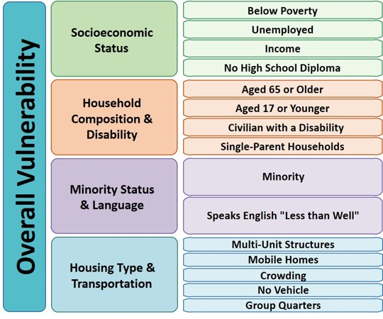

# United States Communities in Harms Way:
## **Where are the Vulnerable in Relation to Wildfire Hazards**  

<!-- TOC -->

## Table of Contents
- [Part I. *DRAFT* Project Proposal](#part-i-project-summary-proposal)  
- [Part II. Data Sources](#part-ii-data-sources)  
    - [Wildfire Hazard Potential ](#wildfire-hazard-potential)
    - [Census Designated Places](#census-designated-places)
    - [Social Vulnerability Index ](#social-vulnerability-index)
- [Part III. Mapping and Visualization](#part-iii-mapping-&-visualization)
- [Part IV. Objectives & User Needs](#part-iv-objectives-&-user-needs)
- [Part V. Data Processing & Storage](#part-v-data-processing-&-stograge)
- [Part VI. Technology Stack](#part-vii-technology-stack)
- [Inspiration](#inspiration)
- [References](#references)  

<!-- /TOC -->

## Part I: Project Summary Proposal

The *spatial analysis* component will first look at 2014 Wildfire Hazard Potential (WHP) for the United States as the initial metric - areas with moderate to very high fire risk will determine what communities are futher analyzed. The results of this will then be overlayed 2015 U.S. Census Designated Places \(CDPs\) polygons \(I need research an appropriate buffer distance that takes into account how far a fire can spread, or if the there is a recommeneded distance at which communities are evacuated) using weighted averaging or zonal statistics to determine what hazard potential is assgined to a CDP. The CDPs will be joined to to multiple tables of U.S. Census 5-year estimate American Community Survey Data profiles (ACS). From these raw ACS data, averages will be calculated for each CDP input into the vulnerability index and compared to the national average. If one of the CDP inputs has an average higher than that of the national average for a given it will be assigned a score of 1 on the vulnerability index. These results of each average calculation will be combined to create a non-weighted vulberability index by which communities will be ranked on a scale from 1-7 (1 being the least vulnerable and 7 being the most vulnerable) that will look something like the following:

## Part II: Data Sources
There are three key datasets that will be used to perform analysis and visualize the results.

### Wildfire Hazard Potential  

1. [2020 Wildfire Hazard Potential (WHP) for the United States](https://www.fs.usda.gov/rmrs/datasets/wildfire-hazard-potential-united-states-270-m-version-2020-3rd-edition). This is a 270-m spatial resolution raster dataset that classifies Wildfire Hazard Potential in the conterminous United States into 5-discrete classes based on percentile breaks:   
       
    - **Class 1:** Very Low
    - **Class 2:**Low
    - **Class 3:**Moderate
    - **Class 4:**High
    - **Class 5:**Very High  

   From the metadata: WHP is an index that quantifies the relative potential for wildfire that may be difficult to control, used as a measure to help prioritize where fuel treatments may be needed.  

   This data won't be displayed on the final map, it will simply be used as an input to define and refine communities that should be further analyzed based on their proxitmity to Wildfire Hazard Potential.  

### Census Designated Places  

2. [U.S. Census Designated Places](https://www2.census.gov/geo/tiger/GENZ2020/shp/cb_2020_us_place_500k.zip). These are simplified representations of selected geographic areas from the U.S. Census Bureau's Master Address File / Topologically Integrated Geographic Encoding and Referencing (MAF/TIGER) Database (MTDB). These boundary files are specifically designed for small-scale thematic mapping.  

This dataset will be the core spatial component of this project and will be repressented in the final product as graduated symbols based on the geometric center of the polygon at max scale and when zoomed in the map will display the full geometry of the polygon. These data will be loaded into the map as geoJSON files.

### Social Vulnerability Index  

3. [Centers for Disease Control Social Vulnerability Index (SVI)](https://www.atsdr.cdc.gov/placeandhealth/svi/documentation/SVI_documentation_2018.html). This data is available at the tract level and has four individual vulnerability components:  

- Socioeconmic
- Household Composition & Disability
- Minority Status & Language
- Housing Type & Transportation
 
As well as a summary ranking.

## Part III. Mapping and Visualization

## Part IV. Objectives & User Needs

## Part V. Data Processing & Storage

## Part VI. Technology Stack

## Inspiration

## References
- [Community Wildfire Prevention & Mitigation Report](https://www.fire.ca.gov/media/5584/45-day-report-final.pdf) ordered the by California Governors Office
- Centers for Disease Control and Prevention/ Agency for Toxic Substances and Disease Registry/ Geospatial Research, Analysis, and Services Program. CDC/ATSDR Social Vulnerability Index 2018 Database United States.