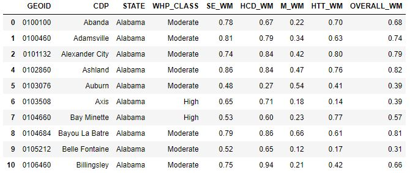

# United States Communities in Harms Way:
## **Where are the Vulnerable in Relation to Wildfire Hazards**  

<!-- TOC -->

## Table of Contents
- [I. Introduction](#introduction)
- [II. Methodology](#II-Methodology)
   - [A. Data](#a-data)
   - [B. Medium for Delivery](#b-medium-for-delivery)
   - [C. Application Layout](#c-application-layout)
   - [D. Thematic Representation](#d-thematic-representation)
   - [E. User Interaction](#e-user-interaction)
   - [F. Aesthetics and Deisgn Considerations](#f-aesthetics-design-considerations)
   - [G. Conclusion](#g-conclusion)
   
<!-- /TOC -->

## I. Introduction  
This project examines where wildfire hazard potential intersects with socially vulnerable census designated places throughout the conterminous United States. The data sources span from 2018 to 2020. 

The map will appeal to those looking to understand not only how wildfire can affect developed areas and their inhabitants but what developed area may be in greater need of support both prior to and after wildland fires. 

The user will be inspired to explore areas not traditionally thought of as areas with high wildfire potential such as the southeast

At a general level the map will potentially reveal specific communities that could benefit from additional emergency response planning effort.

## II: Methodology  
First provide a general statement summarizing the following subsections (one or two sentences).

### A. Data  

1. [2020 Wildfire Hazard Potential (WHP) for the United States](https://www.fs.usda.gov/rmrs/datasets/wildfire-hazard-potential-united-states-270-m-version-2020-3rd-edition). This is a 270-m spatial resolution raster dataset that classifies Wildfire Hazard Potential in the conterminous United States into 5-discrete classes based on percentile breaks:   
       
    - **Class 1:** Very Low
    - **Class 2:** Low
    - **Class 3:** Moderate
    - **Class 4:** High
    - **Class 5:** Very High  
    - **Class 6:** Non-burnable  
    - **Class 7:** Water  

2. [U.S. Census Designated Places (CDPs) ](https://www2.census.gov/geo/tiger/GENZ2020/shp/cb_2020_us_place_500k.zip). These are simplified representations of selected geographic areas from the U.S. Census Bureau's Master Address File / Topologically Integrated Geographic Encoding and Referencing (MAF/TIGER) Database (MTDB). These boundary files are specifically designed for small-scale thematic mapping.    

3. [Centers for Disease Control Social Vulnerability Index (SVIs)](https://www.atsdr.cdc.gov/placeandhealth/svi/documentation/SVI_documentation_2018.html). This data is available at the tract level and has four individual vulnerability components plus an aggregate score:  

    - **Socioeconomic**
    - **Household Composition & Disability**
    - **Minority Status & Language**
    - **Housing Type & Transportation**
    - **Overall Vulnerability**  

The process for exploring, processing and ultimately analyzing the data used Python / Jupyter Notebooks with the the following libraries: Pandas, Matplotlib and GeoPandas. The WHP data was analyzed using zonal statistics where the raster dataset was overlayed with the CDPs to calculate the 'majority' of pixels in each polygon. Based on the majority a WHP class was assigned to each CDP.  

  

Additionally, classes 1, 2, 6, and 7 were removed so that only only CDPs with moderate to very high (classes 3, 4 and 5) hazard potential were included in the final output.  

CDPs were the minimum mapping unit for the analysis yet the SVI data is available only at the tract level which is too detailed. To mitigate this issue another type of overlay analysis was performed; weighted mean area analysis. In this operation the average SVI values for each individual vulnerability and the overall vulnerability are averaged again based on the area inside the CDP polygon they intersect with. The larger the area a particular vulnerability occupies the greater value or weight it is given in calculating the vulnerability score of the CDP. This operation was performed for each individual SVI and for the overall SVI for each CDP with a WHP class of 3,4 or 5.

**Sample results of analyzed and processed data:**  
  

Lastly, the geometric center or centroids of the polygons were taken so that the small or maximum scale mapping described above could be achieved. This process ensured that the attributes in the polygon were retained in the point output.  

The final output polygon and point files are GeoJSON.  

### B. Medium for Delivery  

The map will be a browser-based application accessible across mobile and desktop devices.  

The technology stack will include HTML/CSS/JS using a combination of Leaflet and Mapbox JavaScript libraries and will most likely use an Assembly.css responsive framework. In addition, the map will include search bar functionality geolocating CDPs.  

### C. Application Layout  

### D. Thematic Representation  

The map will use different thematic representations at different scales. At maximum scale the map will use graduated symbols to display overall SVI by CDP broken up into 5 classes and graduated colors to display 3 class WFH potential resulting in a bi-variate map. 

At a yet to be determined zoom scale the map will show actual CDP polygons classified using graduated color to show WHP.  

### E. User Interaction  

The map will be a full screen map that requires user input to explore. These actions include panning, zooming, hovering and clicking on the features. 

When a graduated symbol is hovered on at initial map scale a tooltip will display with some basic information about the feature.  

**Tooltip Example:**  
  

When a feature is clicked on at the initial map scale it will trigger a zoom event where the map will zoom to that feature and a polygon of the CDP will be displayed along with a a sidebar popup holding a bar chart of four SVI weighted mean scores that make up the overall SVI. This capbility will also be available using a a dropdown search of all of CDPs on the map.

### F. Aesthetics and Design Considerations  

### G. Conclusion  

## References
- [Community Wildfire Prevention & Mitigation Report](https://www.fire.ca.gov/media/5584/45-day-report-final.pdf) ordered the by California Governors Office
- Centers for Disease Control and Prevention/ Agency for Toxic Substances and Disease Registry/ Geospatial Research, Analysis, and Services Program. CDC/ATSDR Social Vulnerability Index 2018 Database United States.